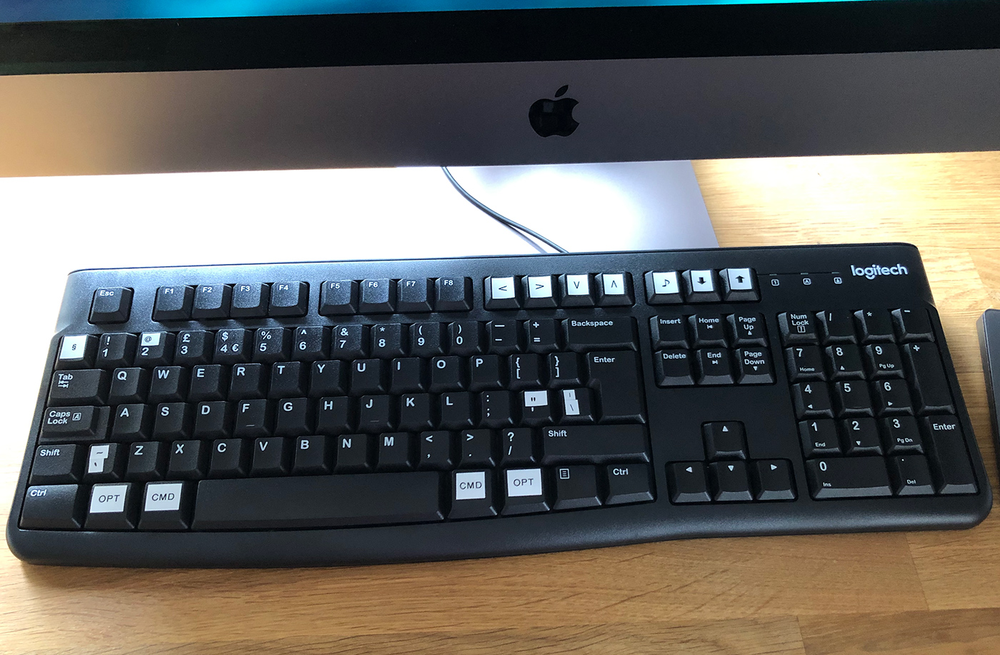

# keymap-k120

I have long used Logitech K120 keyboards for non-Mac workstations, but since I moved from using a MacBook everyday to using an iMac Pro every day, I've struggled to find a keyboard that matches the K120. It's not particularly special, but it's comfortable, cheap, easily replacable, and quiet. Unfortunately, it doesn't work very well with MacOS, especially not out of the box.

With help from friends near and far, and all their previous work, I've been able to finally solve my keyboard misery.

## Remapped keys

`remap-k120` swaps the left and right windows & alt keys to option & command keys, along with swapping F9 onwards. I place this file in `/Users/adam/bin/remap-k120`.

`F9` becomes previous track, `F10` becomes next track.

 `F11` becomes volume down, and `F12` becomes volume up.

`Print Screen` becomes play/pause.

`Scroll Lock` becomes brightness down, and `Pause` becomes brightness up.

I struggled to find the keycodes for these until I found this [fantastic resource](https://www.maven.de/2018/05/more_keyboards/).

## xpc_set_event_stream_handler

The `xpc_set_event_stream_handler` consumes events from MacOS. I'm told this is very important.

To compile this, navigate to the directory containing `main.m` and run `clang -framework Foundation main.m -o bin`.

I then move this to `/usr/local/bin/xpc_set_event_stream_handler`.

## LaunchDaemon

I place the `com.adamkdean.remap-k120.plist` file in `/Library/LaunchDaemons`.

If you use this, be sure to update paths within this file:

```xml
<key>ProgramArguments</key>
	<array>
		<string>/usr/local/bin/xpc_set_event_stream_handler</string>
		<string>/Users/adam/bin/remap-k120</string>
		<string>/bin/bash -c "sleep 5"</string>
	</array>
  ...
```

## Resetting

You can easily reset the mappings using the `default-mapping` file provided by Martin.

## Physical alterations

In order to make my life a little better, I used a label maker to adjust the keyboard slightly.



## Thanks to

- [Martin Thorpe](https://twitter.com/met24fly) without whom I'd have been totally lost
- [Ford Parsons](https://github.com/snosrap) for his work on xpc_set_event_stream_handler
- [Daniel Vollmer](https://www.maven.de/2018/05/more_keyboards/) whose work allowed me to solve the media key issue

## Resources

- https://github.com/snosrap/xpc_set_event_stream_handler
- https://developer.apple.com/library/archive/technotes/tn2450/_index.html
- https://www.usb.org/sites/default/files/documents/hut1_12v2.pdf (page53)
- https://developer.apple.com/documentation/uikit/uikeyboardhidusage
- https://eastmanreference.com/complete-list-of-applescript-key-codes
- https://www.usb.org/sites/default/files/hut1_21_0.pdf#page=118
- https://qa.emptyq.net/q?id=c95a5415-82f8-45cc-98c4-c97f869891f1
- https://www.maven.de/2018/05/more_keyboards/

# Keywords

To help people find this, here are some keywords and associated searches:

- How to use Logitech K120 windows keyboard on Mac?
- Is Logitech K120 compatible with a Mac?
- Logitech K120 Mac
- Can I use Logitech K120 with Mac?
- Logitech K120
- Mac, MacOS, OSX
